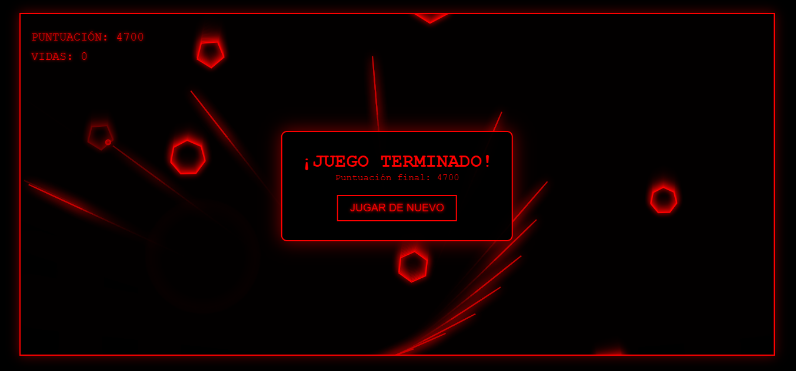

# 🚀 Terra Defense

**Terra Defense** es un juego arcade de estilo **retro y wireframe** (contornos) desarrollado en HTML5 Canvas, CSS y JavaScript puro. El objetivo es defender la Tierra (situada en la parte inferior de la pantalla) de una lluvia interminable de asteroides poligonales.

## ✨ Características Principales

* **Estilo Retro Wireframe:** Interfaz minimalista en blanco y negro con detalles y elementos de juego en **rojo brillante** (`#FF0000`), evocando la estética de juegos arcade clásicos de vectores.
* **Jugabilidad Arcade:** Control simple e intuitivo. Dispara y destruye asteroides que caen para acumular puntos.
* **Mecánica de Disparo Dual:**
    * **Clic simple:** Disparo único.
    * **Clic sostenido:** Activa una **ametralladora** (disparo rápido con retraso de 100ms).
* **Elementos Visuales y Sonoros:**
    * **Asteroides:** Modelos poligonales de 5 a 7 lados que giran y descienden.
    * **Láser:** Los disparos son líneas láser rojas que impactan en el asteroide.
    * **Audio:** Incluye sonidos de disparo, explosión, música de fondo de baja intensidad y un efecto de "Game Over".
    * **Efecto de rastro:** El Canvas utiliza una opacidad de fondo (`rgba(0, 0, 0, 0.2)`) para crear un sutil **efecto de rastro** (ghosting) de los objetos, reforzando la sensación retro.

## 🛠️ Estructura del Proyecto

El proyecto se compone de los siguientes archivos principales:

| Archivo | Descripción |
| :--- | :--- |
| **`index.html`** | Estructura principal del juego (HTML), incluye el Canvas, el HUD (Puntuación/Vidas) y los elementos de audio. |
| **`styles.css`** | Define el aspecto visual, implementando el tema **negro y rojo (wireframe)**, tipografía retro (`'Courier New'`), y el diseño de la pantalla de carga, HUD y Game Over. |
| **`game.js`** | Contiene la lógica completa del juego: manejo de clases (`Asteroid`, `Bomb`, `Explosion`), bucle del juego (`gameLoop`), detección de colisiones y manejo de eventos del ratón. |
| **`favicon.ico`** | El icono del sitio web. |

## 🕹️ Cómo Jugar

1.  **Clonar el Repositorio:** Descarga o clona los archivos `index.html`, `styles.css` y `game.js`.
2.  **Abrir:** Simplemente abre el archivo **`index.html`** en cualquier navegador web moderno (Chrome, Firefox, Edge, etc.).
3.  **Iniciar:** Haz clic en el botón **"COMENZAR"** en la pantalla de instrucciones.

### Controles

| Acción | Control |
| :--- | :--- |
| **Disparo Único** | Clic izquierdo del ratón |
| **Ametralladora** | Mantener presionado el clic izquierdo del ratón |
| **Reiniciar** | Clic en el botón "JUGAR DE NUEVO" en la pantalla de Game Over |

## 📋 Componentes Clave de JavaScript (`game.js`)

El archivo JavaScript define varias clases para estructurar los elementos del juego:

* **`Asteroid`**: Representa a los enemigos. Se generan con un número aleatorio de lados (5 a 7) y una velocidad que aumenta ligeramente para el desafío. Maneja el movimiento de caída y la rotación.
* **`Bomb`**: Representa el disparo láser del jugador. Se origina desde el centro inferior y se dirige al punto del clic.
* **`Explosion`**: Un efecto visual simple de círculos rojos que se expanden y desvanecen, para indicar la destrucción de un asteroide.

La función principal es **`gameLoop()`**, que usa `requestAnimationFrame` para refrescar continuamente el Canvas, dibujar los objetos, actualizar sus posiciones, chequear colisiones y generar nuevos asteroides (`spawnAsteroid`).

## 🎧 Recursos de Audio

Los sonidos del juego se enlazan directamente a recursos públicos de Mixkit:

* Disparo: `shootSound`
* Explosión: `explosionSound`
* Game Over: `gameOverSound`
* Música de Fondo: `backgroundSound` (con volumen bajo).

---